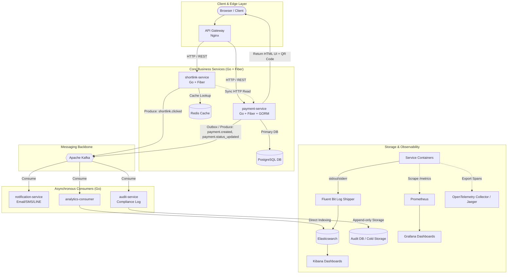

# Event-Driven Shortlink & Payment Platform

[](https://golang.org/)
[](https://gofiber.io/)
[](https://gorm.io/)
[]()
[](https://kafka.apache.org/)

An enterprise-grade **Event-Driven Microservices Architecture** built with **Go (Fiber + GORM)**, **Apache Kafka**, **PostgreSQL**, **Redis**, and a comprehensive **Observability Stack (ELK, Prometheus, Grafana, Jaeger)** using **Clean Architecture**.

---

## 1. System Architecture Diagram



---

## 2. Key Architecture Features & Design Patterns

1. **Clean Architecture Standards**: Strictly enforces 4 layers (`Domain`, `UseCase`, `Repository/Adapter`, `Delivery`) with inner dependency rules for maximum testability and decoupling.
2. **Server-Side Rendered Checkout UI**: `payment-service` serves responsive HTML UI containing dynamic PromptPay/QR Code directly to the client browser.
3. **Transactional Outbox Pattern**: Guarantees zero message loss when dual-writing between PostgreSQL and Kafka in `payment-service`.
4. **Fire-and-Forget Analytics Tracking**: `shortlink-service` emits `shortlink.clicked` event asynchronously without adding latency to the client request.
5. **Three Pillars of Observability**:
   - **Logs**: Container stdout $\rightarrow$ Fluent Bit $\rightarrow$ Elasticsearch $\rightarrow$ Kibana
   - **Metrics**: `/metrics` $\rightarrow$ Prometheus $\rightarrow$ Grafana
   - **Traces**: OpenTelemetry SDK $\rightarrow$ Jaeger (Distributed Waterfall Tracing)

---

## 3. Repository Structure & Microservices Overview

```text
.
├── .vscode/                    # Recommended VS Code settings, extensions & launch configs
├── docs/                       # Architectural specs & design documentation
│   └── architecture.md
├── services/
│   ├── api-gateway/            # Nginx Reverse Proxy & Routing config
│   ├── shortlink-service/      # Core Infrastructure Service (Cache-Aside + Link Resolution)
│   ├── payment-service/        # Business Domain Service (Payment + Outbox + HTML QR Rendering)
│   ├── notification-service/   # Async Kafka Consumer (Email/SMS/LINE Notification)
│   ├── analytics-consumer/     # Async Kafka Consumer (Bulk Indexing to Elasticsearch)
│   └── audit-service/          # Async Kafka Consumer (Immutable Compliance Logs to Postgres)
├── observability/              # Observability configs (Grafana, Prometheus, Fluent Bit)
└── docker-compose.yml          # Container orchestration for all microservices
```

### Services Summary & Documentation Links:

| Service | Language & Framework | Primary Responsibility | Documentation |
| :--- | :--- | :--- | :--- |
| **`shortlink-service`** | Go 1.22 + Fiber | Decode short code, Redis caching, emit click events | [README](services/shortlink-service/README.md) |
| **`payment-service`** | Go 1.22 + Fiber + GORM | Payment domain logic, HTML QR rendering, Outbox pattern | [README](services/payment-service/README.md) |
| **`notification-service`** | Go 1.22 | Consume payment status events and dispatch notifications | [README](services/notification-service/README.md) |
| **`analytics-consumer`** | Go 1.22 | Aggregate events & bulk-index into Elasticsearch | [README](services/analytics-consumer/README.md) |
| **`audit-service`** | Go 1.22 + GORM | Store append-only compliance logs in PostgreSQL | [README](services/audit-service/README.md) |

---

## 4. Kafka Topics Specification

- `shortlink.created`: Published when a new shortlink mapping is registered.
- `shortlink.clicked`: Published on every shortlink access for click analytics.
- `payment.created`: Published when a new payment invoice is created.
- `payment.status_updated`: Published when payment transitions status (`PENDING` $\rightarrow$ `PAID` / `EXPIRED`).

---

## 5. Development & Getting Started

*(Will be populated once environment configuration files and docker setup are completed)*