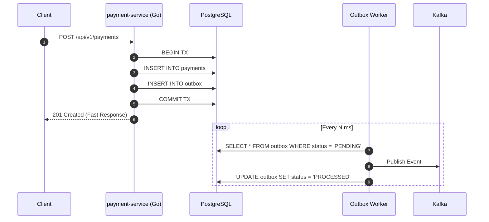

# Full Architecture Specifications & Technical Design

## 1. Overview
This document serves as the authoritative architectural blueprint for the **Event-Driven Shortlink & Payment Platform**. The platform is designed around **Microservices Architecture**, **Clean Architecture Principles**, and **Event-Driven Decoupling** powered by Apache Kafka.

---

## 2. Core Architectural Principles & Patterns

### 2.1 Clean Architecture (4-Layer Structure)
All microservices follow Uncle Bob's Clean Architecture:
- **Domain Layer (`internal/domain`)**: Core business entities and domain logic with zero external dependencies.
- **Use Case Layer (`internal/usecase`)**: Application workflows, business logic interfaces, and orchestration.
- **Repository Layer (`internal/repository`)**: Data mappers and drivers for PostgreSQL (GORM), Redis, and HTTP Clients.
- **Delivery Layer (`internal/delivery`)**: HTTP Fiber handlers, view templates, and Kafka consumer/producer loops.

### 2.2 Transactional Outbox Pattern
To solve the dual-write problem between PostgreSQL and Apache Kafka:
1. `payment-service` writes the payment entity and an outbox event record within the **same DB transaction**.
2. A background worker periodically polls the `outbox` table and publishes pending events to Kafka.
3. Upon successful publication, the record status is updated to `PROCESSED`.



### 2.3 Fire-and-Forget Click Analytics
`shortlink-service` emits `shortlink.clicked` events asynchronously to Kafka without blocking client HTTP responses, ensuring link resolution latency remains minimal.

---

## 3. Data Models & Schemas

### PostgreSQL Database (`payment_db`)

#### Table: `payments`
```sql
CREATE TABLE payments (
    id BIGSERIAL PRIMARY KEY,
    payment_no VARCHAR(64) UNIQUE NOT NULL,
    short_code VARCHAR(32) UNIQUE NOT NULL,
    amount NUMERIC(12, 2) NOT NULL,
    currency VARCHAR(3) DEFAULT 'THB',
    status VARCHAR(32) NOT NULL DEFAULT 'PENDING',
    qr_code_data TEXT,
    created_at TIMESTAMP WITH TIME ZONE DEFAULT CURRENT_TIMESTAMP,
    updated_at TIMESTAMP WITH TIME ZONE DEFAULT CURRENT_TIMESTAMP
);

CREATE INDEX idx_payments_status ON payments(status);
CREATE INDEX idx_payments_short_code ON payments(short_code);
```

#### Table: `outbox`
```sql
CREATE TABLE outbox (
    id UUID PRIMARY KEY DEFAULT gen_random_uuid(),
    aggregate_type VARCHAR(64) NOT NULL,
    aggregate_id VARCHAR(64) NOT NULL,
    topic VARCHAR(128) NOT NULL,
    payload JSONB NOT NULL,
    status VARCHAR(32) DEFAULT 'PENDING',
    created_at TIMESTAMP WITH TIME ZONE DEFAULT CURRENT_TIMESTAMP
);

CREATE INDEX idx_outbox_status ON outbox(status);
```

### Redis Cache (`shortlink-service`)
- **Key**: `shortlink:{code}`
- **Value**: `{"payment_no": "PAY-12345", "target_url": "/checkout/PAY-12345"}`
- **TTL**: 86400 seconds (24 Hours)

---

## 4. Observability Architecture (Three Pillars)

1. **Logging**: Container stdout/stderr $\rightarrow$ Fluent Bit Shipper $\rightarrow$ Elasticsearch $\rightarrow$ Kibana
2. **Metrics**: `/metrics` Endpoints $\rightarrow$ Prometheus $\rightarrow$ Grafana Dashboards
3. **Tracing**: OpenTelemetry SDK $\rightarrow$ Jaeger (Distributed Waterfall Request Tracing)
